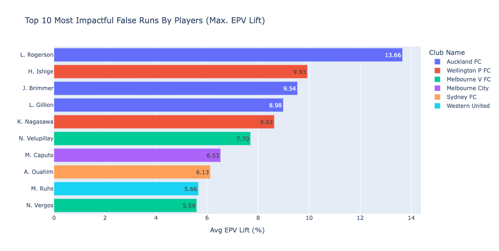
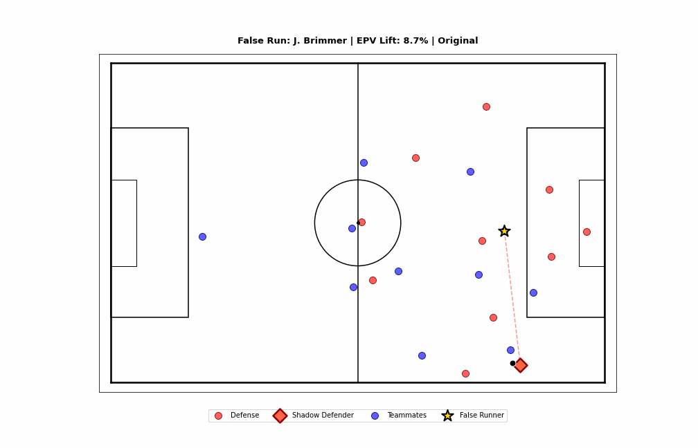

# SkillCorner X PySport Analytics Cup - Research Track
**Submission By:** Esha Shah

Please review the `submission.ipynb` file for the full code. An online static version can be found here: [Marimo Notebook](https://static.marimo.app/static/false-run-analysis-43m0).

---

## Research Track Abstract(max. 500 words)
### Quantifying the Unseen: Valuing False Runs with Expected Possession Value (EPV)
#### Introduction
Most popular analytics focus on ball actions; the impact demonstrated through false runs (decoy movements to break defensive structures without receiving the ball) is undervalued and unmeasured. The challenge is to isolate the effect of a false run on the overall team success. 

This research introduces a framework for detecting false runs and quantifying their impact using causal inference techniques applied to SkillCorner's tracking and dynamic event data. What would have happened if the false run never happened? I will compare the actual game states against "ghost" scenarios where runners stayed in their original positions, to measure the value added by off-ball movements. 

#### Methods
**False Run Detection**

I identified false runs from SkillCorner's dynamic events data by filtering for events with the following conditions: 

- Events started and ended in the attacking third
- Identified as an off-ball run 
- Runners did not receive the ball within 5 seconds (50 frames) after the run
- Certain off-ball run types: 'behind', 'run_ahead_of_the_ball', etc

Additionally, these events were incorporated into the tracking dataset.

**Expected Possession Value Model (EPV)**

To quantify the false run, I developed an EPV model using XGBoost that predicts the probability of a shot occurring within the next 10 seconds (100 frames) based on the current game state. EPV looks at the entire state of the game using tracking and event data. The model uses 4 features derived from tracking data at each frame: 

- Distance to Goal: The Euclidean distance from ball position to the center of the opposing goal, $$\sqrt{(goal_x - ball_x)^2 + (goal_y)^2}$$
- Angle to Goal: The angle between the ball and the goal centerline,  computed using atan2(0 − ball_y, goal_x − ball_x)
- Packing Rate: The # of defenders positioned behind the ball
- Pressure Distance: The distance from the ball to the nearest defending player

I labelled positive events as any frame occurring within 100 frames before a shot event, creating a binary classification task. The XGBoost classifier provided a probability score representing the offensive threat level for any given frame. 

**Counterfactual Lift Calculation**

The "Counterfactual" state was creating "ghost" game states that represent what would have occurred without a false run. For each identified false run, the opponent closest to the runner at frame_start was determined, assuming they are most likely tracking the runner.  

Next, I created a "hybrid scenario" where the false run never happened, but the rest of the play progressed normally by resetting both the runner and the closest defender's positions. 

Thereafter, I calculate the false run impact by comparing the EVP between the actual and the counterfactual scenarios: `EPV lift = acutal_epv - ghost_epv`. 

A positive lift indicates the false run is increasing the team's probability of generating a shot.

#### Results

The top 10 false runs that were identified by EPV.

#### Conclusion

The false runner drags the defender into space away from the play. The blue team is effectively able to pass and make a shot. 

This metric can be turned into an open-source package to easily calculate the lift and impact of a false run using tracking data. 

---
## More Information
This repository contains the submission template for the SkillCorner X PySport Analytics Cup **Research Track**. Find the Analytics Cup [**Rules**]([https://github.com/SkillCorner/opendata/tree/master/data](https://pysport.org/analytics-cup/rules)) and [**tutorials**](https://github.com/SkillCorner/opendata/tree/master/resources) on the [**SkillCorner Open Data Repository**](https://github.com/SkillCorner/opendata).

All thoughts and ideas are my own; the formatting and code were elevated with the use of Gemini AI. Thank you for your time!
